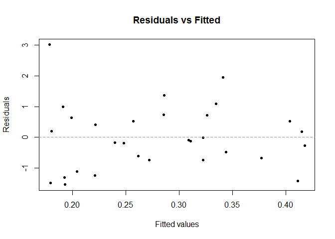
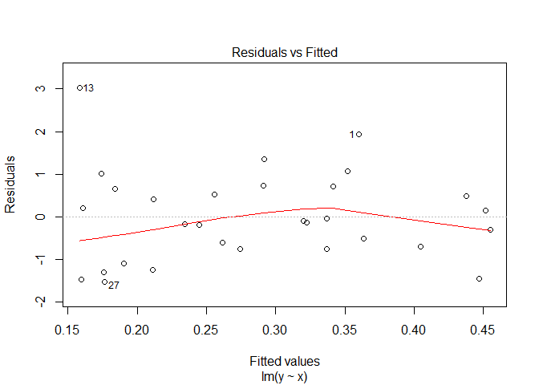
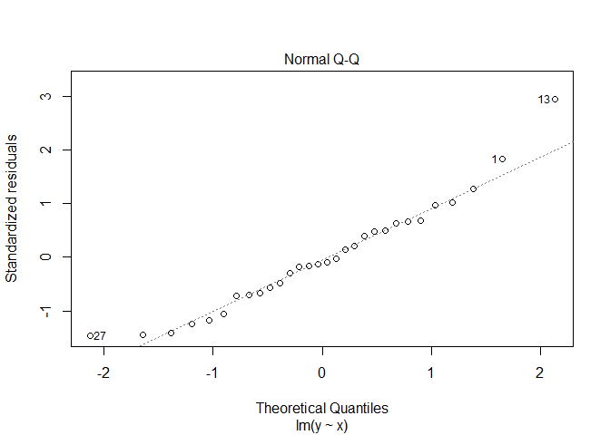
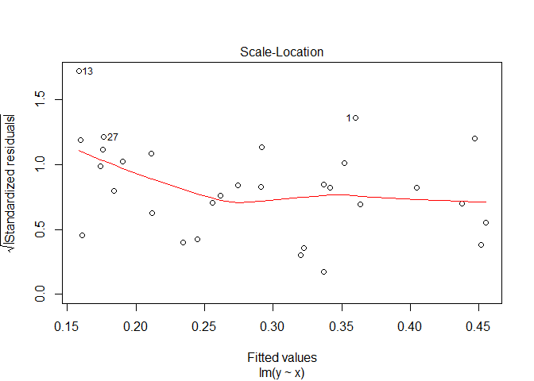
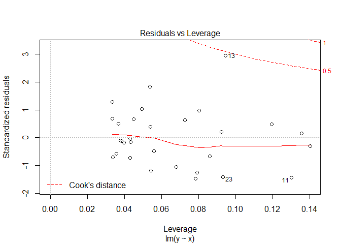

Class project: Bayesian linear regresssion
------------------------------------------

Implement a constructor for a `blm` class. One approach, taken from the textbook, is implementing an `update` function and a `blm` function:

``` r
update <- function(model, prior, ...) { ... }
blm <- function(model, ...) {
    # some code here...
    prior <- make_a_prior_distribution_somehow()
    posterior <- update(model, prior, ...)
    # some code that returns an object here...
}
```

To get this version of `blm` to work you need to get the prior in a form you can pass along to `update` but if you did the exercises earlier you should already have a function that does this (although you might want to create a class for these distributions and return them as such so you can manipulate them through an interface if you want to take it a bit further).

``` r
# Importing useful functions

## Prior (Likelihhod Distribution) p(Data|w)
make_prior <- function(model, alpha, ...) {
  
  res = function(n = 1) mvrnorm(n, mu = c(0,0), Sigma = diag(1/alpha, nrow = 2))
  return(res)
}

## Posterior Distribution p(w|Data)p(w)
make_posterior <-function(model, alpha, beta, ...){
  theta_x = model_matrix(model, ...)
  
  S_xy_inv = diag(alpha, nrow = ncol(theta_x)) + beta * t(theta_x) %*% theta_x
  
  # Inverting back the matrix by solving it
  S_xy = solve(S_xy_inv)
  m_xy = beta * S_xy %*% t(theta_x) %*% y
  
  return(list(S_xy = S_xy, m_xy = m_xy))
}

## Sampling from posterior
sample_from_posterior <- function(n, model, alpha, beta, ...) {
  # specialize a function by n
  stat = make_posterior(model, alpha, beta)
  S_xy = stat$S_xy
  m_xy = stat$m_xy

  res <- as.data.frame(mvrnorm(n, mu=m_xy, Sigma=S_xy))
  w_names = sprintf("w%d", 0:(ncol(res)-1)) 
  colnames(res) = w_names
  return(res)
}

## Dealing with models 
model_matrix <- function(model, ...){
  model.matrix(model, ...)
}

## 
noresponse_matrix <- function(model, ...){
  responseless = delete.response(terms(model))
  
  data_frame = model.frame(responseless, ...)
  
  res = model.matrix(responseless, data_frame)
  return(res) 
}

##
predict.blm <- function(object, ...) {
  formula = object$formula
  posterior = object$posterior
  beta = object$beta
  
  # Generalizing theta for old and new data (using '...' method)
  theta_x = noresponse_matrix(formula, ...)

  m_xy = posterior$m_xy
  S_xy = posterior$S_xy

  # Dealing with many data points:
  sds = vector(length = nrow(theta_x))
  means = vector(length = nrow(theta_x))
  var = vector(length = nrow(theta_x))
  
  for(i in seq_along(sds)){      
    S_xxy = 1/beta + (t(theta_x[i,]) %*% S_xy %*% theta_x[i,])
    sds[i] = sqrt(S_xxy)
    var[i] = S_xxy
    means[i] = sum(t(m_xy) %*% theta_x[i,])
  }
  
  return(list(sds = sds, means = means, S_xy = var))
  
}
```

``` r
# Creating the class blm
make_prior <- function(model, alpha, ...){
  arguments <- list(...)
  if (alpha < 0) stop('alpha must be positive!')
  
  model <- model.matrix(model)
  return(list(m_xy = rep(0, ncol(model)), S_xy = diag(1/alpha, nrow = ncol(model))))
}

update <- function(model, prior, alpha, beta, ...){
  arguments <- list(...)

  if(alpha < 0 || beta  < 0) stop('alpha and beta must be positive!')
  
  data <- model.frame(model)
  theta_x = noresponse_matrix(model)
  S_xy <- solve(prior$S_xy + beta * t(theta_x) %*% theta_x)
  m_xy <- beta * S_xy %*% t(theta_x) %*% y
  return(list(m_xy=m_xy, S_xy=S_xy))
  
}

blm <- function(model, ...) {
  arguments <- list(...)
  alpha = arguments$alpha
  beta = arguments$beta
  prior <- make_prior(model, alpha,...) # it returns alpha
  posterior <- update(model, prior, beta, ...)

  # Defining the class blm
  obj <- list(data = model.frame(model),
              variances = posterior$S_xy,
              prior = prior,
              alpha = alpha,
              beta = beta,
              posterior = posterior,
              formula = model,
              sys = sys.call(),
              coefficients = posterior$m_xy)
  class(obj) <- 'blm'
  obj
}
```

### Model methods

There are some polymorphic functions that are generally provided by classes that represent fitted models. Not all models implement all of them, but the more you implement, the more existing code can manipulate your new class; another reason for providing interfaces to objects through functions only.

Below is a list of functions that I think your `blm` class should implement. The functions are listed in alphabetical order, but many of them are easier to implement by using one or more of the others. So read through the list before you start programming. If you think that one function can be implemented simpler by calling one of the others, then implement it that way.

In all cases, read the R documentation for the generic function first. You need the documentation to implement the right interface for each function anyway so you might at least read the whole thing. The description in this note is just an overview of what the functions should do.

#### coefficients

This function should return fitted arguments of the model. It is not entirely straightforward to interpret what that means with our Bayesian models where a fitted model is a distribution and not a single point parameter. We could let the function return the fitted distribution, but the way this function is typically used that would make it useless for existing code to access the fitted arguments for this model as a drop in replacement for the corresponding arguments from a `lm` model, for example. Instead, it is probably better to return the point estimates of the arguments which would be the mean of the posterior you compute when fitting.

Return the result as a numeric vector with the arguments named. That would fit what you get from `lm`.

``` r
x <- runif(30)
y <- rnorm(30, mean=x)

test_blm = blm(y ~ x, alpha = 1.5, beta = 2)
test_lm = lm( y ~ x)
# Creating the polymorphic function and adding an alias to it:
coefficients.blm <- coef.blm <- function(object, ...) t(object$coefficients)

# Test blm
coefficients(test_blm)
```

    ##      (Intercept)          x
    ## [1,]   0.4192213 -0.2570808

``` r
coef(test_blm)
```

    ##      (Intercept)          x
    ## [1,]   0.4192213 -0.2570808

``` r
# Test lm
coef(test_lm)
```

    ## (Intercept)           x 
    ##   0.4565607  -0.3180524

#### predict

This function should make predictions based on the fitted model. Its interface is

``` r
predict(object, ...)
```

but the convention is that you give it new data in a variable `newdata`. If you do not provide new data, it instead gives you the predictions on the data used to fit the model.

``` r
predict.blm <- function(object, ...) {

  formula = object$formula
  posterior = object$posterior
  beta = object$beta
  
  theta_x = noresponse_matrix(formula, ...)

  # Generalizing theta for old and new data (using '...' method)
  m_xy = posterior$m_xy
  S_xy = posterior$S_xy

  # Dealing with many data points:
  means = vector(length = nrow(theta_x))
  
  for(i in seq_along(means)){      
    means[i] = sum(t(m_xy) %*% theta_x[i,])
  }

  return(list(means = means))
}

# Testing it
newdata <- data.frame(x=runif(3))

# blm method
predict(test_blm, newdata)
```

    ## $means
    ## [1] 0.3061337 0.2419317 0.3638887

``` r
# lm method
predict(test_lm, newdata)
```

    ##         1         2         3 
    ## 0.3166523 0.2372236 0.3881050

``` r
# blm method
predict(test_blm)
```

    ## $means
    ##  [1] 0.3410030 0.2570038 0.1922194 0.3344329 0.3107906 0.4148933 0.2039252
    ##  [8] 0.3439357 0.2717254 0.3261933 0.4111743 0.2395838 0.1782351 0.3090749
    ## [15] 0.2853488 0.4177674 0.1988226 0.1909153 0.2615011 0.2209598 0.3222727
    ## [22] 0.3772257 0.1794175 0.4038634 0.1800640 0.2213185 0.1928109 0.2859031
    ## [29] 0.2478979 0.3224127

``` r
# lm method
predict(test_lm)
```

    ##         1         2         3         4         5         6         7 
    ## 0.3597915 0.2558703 0.1757210 0.3516632 0.3224137 0.4512063 0.1902031 
    ##         8         9        10        11        12        13        14 
    ## 0.3634198 0.2740834 0.3414694 0.4466052 0.2343189 0.1584201 0.3202911 
    ##        15        16        17        18        19        20        21 
    ## 0.2909378 0.4547620 0.1838903 0.1741077 0.2614342 0.2112778 0.3366190 
    ##        22        23        24        25        26        27        28 
    ## 0.4046051 0.1598830 0.4375604 0.1606828 0.2117216 0.1764528 0.2916237 
    ##        29        30 
    ## 0.2446048 0.3367921

#### fitted

This function should give you the fitted response variables. This is *not* the response variables in the data you fitted the model to, but instead the predictions that the model makes.

``` r
# You can only put the old data here, the newdata will be ignored in the predict function 
fitted.blm <- function(object, ...) {
  fit <- predict(object)
  fit
}

# Test blm
fitted(test_blm)
```

    ## $means
    ##  [1] 0.3410030 0.2570038 0.1922194 0.3344329 0.3107906 0.4148933 0.2039252
    ##  [8] 0.3439357 0.2717254 0.3261933 0.4111743 0.2395838 0.1782351 0.3090749
    ## [15] 0.2853488 0.4177674 0.1988226 0.1909153 0.2615011 0.2209598 0.3222727
    ## [22] 0.3772257 0.1794175 0.4038634 0.1800640 0.2213185 0.1928109 0.2859031
    ## [29] 0.2478979 0.3224127

``` r
# Even if I give new data it is not going to do anything with it:
fitted(test_blm, newdata)
```

    ## $means
    ##  [1] 0.3410030 0.2570038 0.1922194 0.3344329 0.3107906 0.4148933 0.2039252
    ##  [8] 0.3439357 0.2717254 0.3261933 0.4111743 0.2395838 0.1782351 0.3090749
    ## [15] 0.2853488 0.4177674 0.1988226 0.1909153 0.2615011 0.2209598 0.3222727
    ## [22] 0.3772257 0.1794175 0.4038634 0.1800640 0.2213185 0.1928109 0.2859031
    ## [29] 0.2478979 0.3224127

``` r
# Test lm
fitted(test_lm)
```

    ##         1         2         3         4         5         6         7 
    ## 0.3597915 0.2558703 0.1757210 0.3516632 0.3224137 0.4512063 0.1902031 
    ##         8         9        10        11        12        13        14 
    ## 0.3634198 0.2740834 0.3414694 0.4466052 0.2343189 0.1584201 0.3202911 
    ##        15        16        17        18        19        20        21 
    ## 0.2909378 0.4547620 0.1838903 0.1741077 0.2614342 0.2112778 0.3366190 
    ##        22        23        24        25        26        27        28 
    ## 0.4046051 0.1598830 0.4375604 0.1606828 0.2117216 0.1764528 0.2916237 
    ##        29        30 
    ## 0.2446048 0.3367921

``` r
# How does lm deal with it?
fitted(test_lm, newdata)
```

    ##         1         2         3         4         5         6         7 
    ## 0.3597915 0.2558703 0.1757210 0.3516632 0.3224137 0.4512063 0.1902031 
    ##         8         9        10        11        12        13        14 
    ## 0.3634198 0.2740834 0.3414694 0.4466052 0.2343189 0.1584201 0.3202911 
    ##        15        16        17        18        19        20        21 
    ## 0.2909378 0.4547620 0.1838903 0.1741077 0.2614342 0.2112778 0.3366190 
    ##        22        23        24        25        26        27        28 
    ## 0.4046051 0.1598830 0.4375604 0.1606828 0.2117216 0.1764528 0.2916237 
    ##        29        30 
    ## 0.2446048 0.3367921

``` r
# Don't care like I do. :)
```

#### confint

The function `confint` gives you confidence intervals for the fitted arguments. Here we have the same issue as with `coefficients`: we infer an entire distribution and not a parameter (and in any case, our arguments do not have confidence intervals; they have a joint distribution). Nevertheless, we can compute the analogue to confidence intervals from the distribution we have inferred.

If our posterior is distributed as **w** ∼ *N*(**m**, **S**) then component *i* of the weight vector is distributed as *w*<sub>*i*</sub> ∼ *N*(*m*<sub>*i*</sub>, **S**<sub>*i*, *i*</sub>). From this, and the desired fraction of density you want, you can pull out the thresholds that match the quantiles you need.

You take the `level` parameter of the function and get the threshold quantiles by exploiting that a normal distribution is symmetric. So you want the quantiles to be `c(level/2, 1-level/2)`. From that, you can get the thresholds using the function `qnorm`.

``` r
confint.blm <- function(object, level= 0.95, ...) {
  theta_x = noresponse_matrix(object$formula, ...)
  beta = object$beta
  S_xy = object$posterior$S_xy

  # Calculating Standard deviation to be used in qnorm
  sds = vector(length = nrow(theta_x))  

  for(i in seq_along(sds)){  
    S_xxy = 1/beta + (t(theta_x[i,]) %*% S_xy %*% theta_x[i,])
    sds[i] = sqrt(S_xxy)
  }
  
  fitted <- predict(object, ...)
  quantil_lower <- qnorm(p = (1-level)/2, mean = fitted$means, sd = sds, lower.tail = F)
  quantil_upper <- qnorm(p = (1 - (1 -level)/2), mean = fitted$means, sd = sds, lower.tail = F)
  
  quantiles = cbind(quantil_lower, quantil_upper)
  colnames(quantiles) = c(print((1-level)/2), print((1 - (1 -level)/2)))
  # It returns mean and sd
  return(quantiles)
}

# Test blm
confint(test_blm, level = 0.95)
```

    ## [1] 0.025
    ## [1] 0.975

    ##          0.025     0.975
    ##  [1,] 1.760880 -1.078874
    ##  [2,] 1.667831 -1.153823
    ##  [3,] 1.628242 -1.243803
    ##  [4,] 1.751902 -1.083036
    ##  [5,] 1.721965 -1.100384
    ##  [6,] 1.880947 -1.051161
    ##  [7,] 1.633367 -1.225516
    ##  [8,] 1.764979 -1.077108
    ##  [9,] 1.680712 -1.137261
    ## [10,] 1.741046 -1.088660
    ## [11,] 1.874093 -1.051744
    ## [12,] 1.654465 -1.175297
    ## [13,] 1.623260 -1.266790
    ## [14,] 1.719938 -1.101788
    ## [15,] 1.693932 -1.123234
    ## [16,] 1.886301 -1.050767
    ## [17,] 1.631025 -1.233380
    ## [18,] 1.627725 -1.245894
    ## [19,] 1.671612 -1.148609
    ## [20,] 1.642406 -1.200486
    ## [21,] 1.736039 -1.091494
    ## [22,] 1.815429 -1.060978
    ## [23,] 1.623634 -1.264799
    ## [24,] 1.860861 -1.053134
    ## [25,] 1.623842 -1.263714
    ## [26,] 1.642616 -1.199979
    ## [27,] 1.628480 -1.242858
    ## [28,] 1.694496 -1.122690
    ## [29,] 1.660591 -1.164796
    ## [30,] 1.736216 -1.091391

``` r
# Test lm
confint(test_lm)
```

    ##                  2.5 %   97.5 %
    ## (Intercept) -0.3767579 1.289879
    ## x           -1.6786635 1.042559

#### deviance

This function just computes the sum of squared distances from the predicted response variables to the observed. This should be easy enough to compute if you could get the squared distances, or even if you only had the distances and had to square them yourself. Perhaps there is a function that gives you that?

``` r
deviance.blm <- function(object, ...){
  observed = object$data[,1]
  fit = fitted(object)$means
  dev = (fit - observed)^2
  sum(dev)
}

# Test blm
deviance(test_blm)  
```

    ## [1] 32.54917

``` r
# Test lm
deviance(test_lm)
```

    ## [1] 32.53873

#### residuals

This function returns the residuals of the fit. That is the difference between predicted values and observed values for the response variable.

``` r
residuals.blm <- function(object, ...){
  observed = object$data[,1]
  x = as.data.frame(object$data[,2])
  predicted = predict(object, x)$means
  residuals = (observed - predicted) 
  residuals
}

# Test it for blm
residuals(test_blm)
```

    ##  [1]  1.95264568  0.52767080 -1.30733005  1.09707652 -0.12169468
    ##  [6]  0.18230506 -1.11036184 -0.48501908 -0.74422730  0.72493202
    ## [11] -1.41571563 -0.17141728  3.00994755 -0.08691707  0.72925350
    ## [16] -0.26632673  0.64210798  0.99224320 -0.60993841 -1.24853764
    ## [21] -0.01660256 -0.67023482 -1.47740878  0.52718605  0.19520361
    ## [26]  0.40343764 -1.53905782  1.36146486 -0.19559781 -0.73934654

``` r
# Test it for lm
residuals(test_lm)
```

    ##           1           2           3           4           5           6 
    ##  1.93385716  0.52880427 -1.29083172  1.07984621 -0.13331777  0.14599204 
    ##           7           8           9          10          11          12 
    ## -1.09663976 -0.50450316 -0.74658533  0.70965589 -1.45114661 -0.16615233 
    ##          13          14          15          16          17          18 
    ##  3.02976253 -0.09813325  0.72366443 -0.30332139  0.65704024  1.00905082 
    ##          19          20          21          22          23          24 
    ## -0.60987154 -1.23885563 -0.03094885 -0.69761425 -1.45787423  0.49348899 
    ##          25          26          27          28          29          30 
    ##  0.21458482  0.41303455 -1.52269977  1.35574432 -0.19230470 -0.75372601

#### plot

This function plots your model. You are pretty free to decide how you want to plot it, but I could imagine that it would be useful to see an x-y plot with a line going through it for the fit. If there are more than one predictor variable, though, I am not sure what would be a good way to visualise the fitted model. There are no explicit rules for what the `plot` function should do, except for plotting something so you can use your imagination.

``` r
plot.blm <- function(object, ...) {
  data = object$data

  if(is.null(data) == FALSE && ncol(data) == 2){
   # plot(data[,2],data[,1], pch = 20, xlab = 'x', ylab = 'y')
  #  abline(a = object$coefficients[1], b = object$coefficients[2], col="red")
    
    # First plot: fitted values vs residuals
    fit = fitted(object)$means
    resid = residuals(object)
    plot(fit, resid, pch = 20, xlab = 'Fitted values', ylab = 'Residuals', main = 'Residuals vs Fitted') 
    abline(h = 0, col = "gray60", lty = 2)
  }
}

plot(test_blm)
```



``` r
plot(test_lm)
```



``` r
# 1- residuals versus fitted data
# 2- q-q plot (theoretical quantiles versus standardized residuals)
# 3- third graph i do not understand much
# 4- Residuals versus leverage
```

#### print

This function is what gets called if you explicitly print an object or if you just write an expression that evaluates to an object of the class in the R terminal. Typically it prints a very short description of the object.

For fitted objects, it customarily prints how the fitting function was called and perhaps what the fitted coefficients were or how good the fit was. You can check out how `lm` objects are printed to see an example.

If you want to print how the fitting function was called you need to get that from when you fit the object in the `blm` constructor. It is how the constructor was called that is of interest, after all. Inside that function, you can get the way it was called by using the function `sys.call`.

``` r
# Print gives/print the called function and the coefficients 
print.blm <- function(object, ...){
  cat('\nCall:\n')
  print(object$sys)
  
  cat('\nCoefficients:\n')
  t(object$coefficients) 
}

# Test it
print(test_blm)
```

    ## 
    ## Call:
    ## blm(y ~ x, alpha = 1.5, beta = 2)
    ## 
    ## Coefficients:

    ##      (Intercept)          x
    ## [1,]   0.4192213 -0.2570808

``` r
print(test_lm)
```

    ## 
    ## Call:
    ## lm(formula = y ~ x)
    ## 
    ## Coefficients:
    ## (Intercept)            x  
    ##      0.4566      -0.3181

#### summary

This function is usually used as a longer version of print. It gives you more information about the fitted model.

It does more than this, however. It returns an object with summary information. What that actually means is up to the model implementation so do what you like here.

``` r
# As the name says, the summary function should be summary of everything
getAnywhere(summary.lm)
```

    ## A single object matching 'summary.lm' was found
    ## It was found in the following places
    ##   package:stats
    ##   registered S3 method for summary from namespace stats
    ##   namespace:stats
    ## with value
    ## 
    ## function (object, correlation = FALSE, symbolic.cor = FALSE, 
    ##     ...) 
    ## {
    ##     z <- object
    ##     p <- z$rank
    ##     rdf <- z$df.residual
    ##     if (p == 0) {
    ##         r <- z$residuals
    ##         n <- length(r)
    ##         w <- z$weights
    ##         if (is.null(w)) {
    ##             rss <- sum(r^2)
    ##         }
    ##         else {
    ##             rss <- sum(w * r^2)
    ##             r <- sqrt(w) * r
    ##         }
    ##         resvar <- rss/rdf
    ##         ans <- z[c("call", "terms", if (!is.null(z$weights)) "weights")]
    ##         class(ans) <- "summary.lm"
    ##         ans$aliased <- is.na(coef(object))
    ##         ans$residuals <- r
    ##         ans$df <- c(0L, n, length(ans$aliased))
    ##         ans$coefficients <- matrix(NA, 0L, 4L)
    ##         dimnames(ans$coefficients) <- list(NULL, c("Estimate", 
    ##             "Std. Error", "t value", "Pr(>|t|)"))
    ##         ans$sigma <- sqrt(resvar)
    ##         ans$r.squared <- ans$adj.r.squared <- 0
    ##         return(ans)
    ##     }
    ##     if (is.null(z$terms)) 
    ##         stop("invalid 'lm' object:  no 'terms' component")
    ##     if (!inherits(object, "lm")) 
    ##         warning("calling summary.lm(<fake-lm-object>) ...")
    ##     Qr <- qr.lm(object)
    ##     n <- NROW(Qr$qr)
    ##     if (is.na(z$df.residual) || n - p != z$df.residual) 
    ##         warning("residual degrees of freedom in object suggest this is not an \"lm\" fit")
    ##     r <- z$residuals
    ##     f <- z$fitted.values
    ##     w <- z$weights
    ##     if (is.null(w)) {
    ##         mss <- if (attr(z$terms, "intercept")) 
    ##             sum((f - mean(f))^2)
    ##         else sum(f^2)
    ##         rss <- sum(r^2)
    ##     }
    ##     else {
    ##         mss <- if (attr(z$terms, "intercept")) {
    ##             m <- sum(w * f/sum(w))
    ##             sum(w * (f - m)^2)
    ##         }
    ##         else sum(w * f^2)
    ##         rss <- sum(w * r^2)
    ##         r <- sqrt(w) * r
    ##     }
    ##     resvar <- rss/rdf
    ##     if (is.finite(resvar) && resvar < (mean(f)^2 + var(f)) * 
    ##         1e-30) 
    ##         warning("essentially perfect fit: summary may be unreliable")
    ##     p1 <- 1L:p
    ##     R <- chol2inv(Qr$qr[p1, p1, drop = FALSE])
    ##     se <- sqrt(diag(R) * resvar)
    ##     est <- z$coefficients[Qr$pivot[p1]]
    ##     tval <- est/se
    ##     ans <- z[c("call", "terms", if (!is.null(z$weights)) "weights")]
    ##     ans$residuals <- r
    ##     ans$coefficients <- cbind(est, se, tval, 2 * pt(abs(tval), 
    ##         rdf, lower.tail = FALSE))
    ##     dimnames(ans$coefficients) <- list(names(z$coefficients)[Qr$pivot[p1]], 
    ##         c("Estimate", "Std. Error", "t value", "Pr(>|t|)"))
    ##     ans$aliased <- is.na(coef(object))
    ##     ans$sigma <- sqrt(resvar)
    ##     ans$df <- c(p, rdf, NCOL(Qr$qr))
    ##     if (p != attr(z$terms, "intercept")) {
    ##         df.int <- if (attr(z$terms, "intercept")) 
    ##             1L
    ##         else 0L
    ##         ans$r.squared <- mss/(mss + rss)
    ##         ans$adj.r.squared <- 1 - (1 - ans$r.squared) * ((n - 
    ##             df.int)/rdf)
    ##         ans$fstatistic <- c(value = (mss/(p - df.int))/resvar, 
    ##             numdf = p - df.int, dendf = rdf)
    ##     }
    ##     else ans$r.squared <- ans$adj.r.squared <- 0
    ##     ans$cov.unscaled <- R
    ##     dimnames(ans$cov.unscaled) <- dimnames(ans$coefficients)[c(1, 
    ##         1)]
    ##     if (correlation) {
    ##         ans$correlation <- (R * resvar)/outer(se, se)
    ##         dimnames(ans$correlation) <- dimnames(ans$cov.unscaled)
    ##         ans$symbolic.cor <- symbolic.cor
    ##     }
    ##     if (!is.null(z$na.action)) 
    ##         ans$na.action <- z$na.action
    ##     class(ans) <- "summary.lm"
    ##     ans
    ## }
    ## <bytecode: 0x0000000016705f48>
    ## <environment: namespace:stats>

``` r
summary(test_lm)
```

    ## 
    ## Call:
    ## lm(formula = y ~ x)
    ## 
    ## Residuals:
    ##     Min      1Q  Median      3Q     Max 
    ## -1.5227 -0.7343 -0.1157  0.6250  3.0298 
    ## 
    ## Coefficients:
    ##             Estimate Std. Error t value Pr(>|t|)
    ## (Intercept)   0.4566     0.4068   1.122    0.271
    ## x            -0.3181     0.6642  -0.479    0.636
    ## 
    ## Residual standard error: 1.078 on 28 degrees of freedom
    ## Multiple R-squared:  0.008122,   Adjusted R-squared:  -0.0273 
    ## F-statistic: 0.2293 on 1 and 28 DF,  p-value: 0.6358

``` r
# The easiest way:
summary.blm <- function(object, ...) {
  sapply(object$data, summary)
  cat('\nCall:\n')
  print(object$sys)
  
  cat('\nResiduals:\n')
  print('Nothing yet')
  #sapply(object$residuals, summary) 
  
  cat('\nCoefficients:\n')
  print('Estimate, Std error, t value, Pr(>|t|)')

  cat('\nResidual standard error, numberX, on numberZ degrees of freedom\n')
  cat('\nMultiple R-squared:\n')
  cat('Adjusted R-squared:\n')
  
} 
summary(test_blm)
```

    ## 
    ## Call:
    ## blm(y ~ x, alpha = 1.5, beta = 2)
    ## 
    ## Residuals:
    ## [1] "Nothing yet"
    ## 
    ## Coefficients:
    ## [1] "Estimate, Std error, t value, Pr(>|t|)"
    ## 
    ## Residual standard error, numberX, on numberZ degrees of freedom
    ## 
    ## Multiple R-squared:
    ## Adjusted R-squared:

``` r
# The hard and freedom way

## Creating Classes of summary
# Using the same arguments as summary and creating a summary custom class

summary.customclass <- function(object, ...){
  cat('\nCall:\n')
  print(object$sys)
  
  cat('\nCoefficients:\n')
  t(object$coefficients) 
}
```
